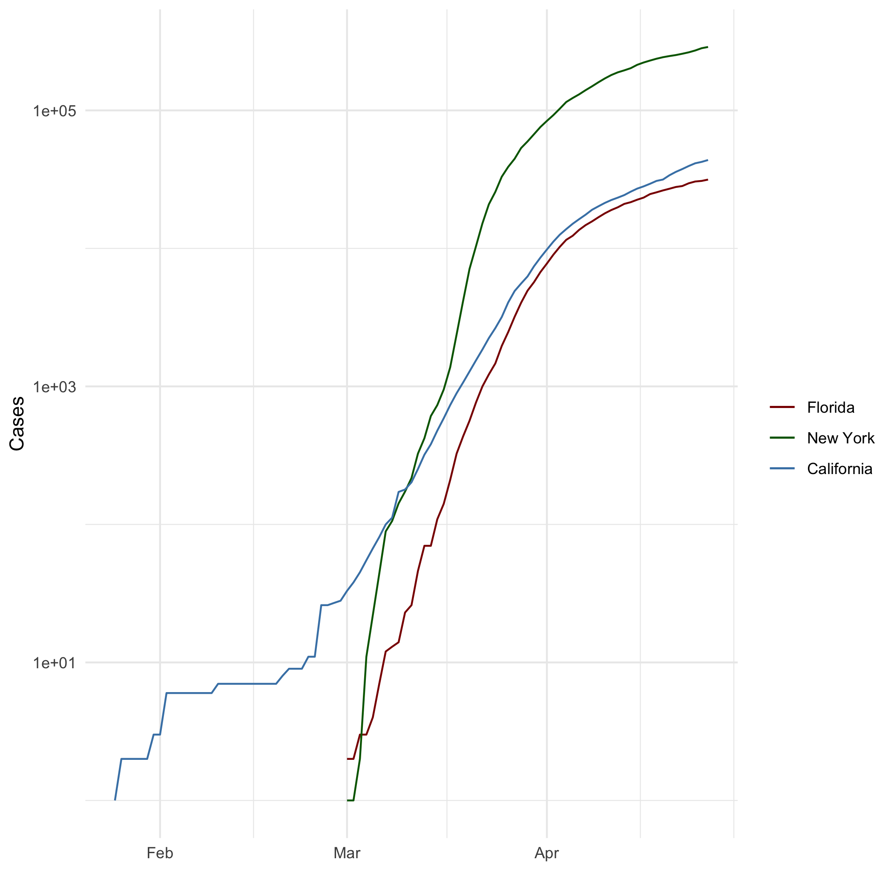

# Markdown Basics

## Favorite Foods
1. Anything prepared for me
1. Wife's cooking
1. Sushi

## Images



\pagebreak

## Add a Quote
> "The best laid plans of mice and men go oft awry, and leave naught but pain and suffering for promised joy."[^1]

-- *To a Mouse*, Robert Burns


## Add an Equation

$r=\frac{\sum(x_i-\bar{x})(y_i-\bar{y})}{(N-1)s_xs_y}$\newline\newline\newline

\pagebreak

## Add a Footnote

>"The path of the righteous man and defender is beset on all sides by the iniquity of the selfish and the tyranny of evil men. Blessed is he, who in the name of charity and good will, shepherds the weak through the valley of darkness, for he is truly his brother's keeper, and the father of lost children. And I will execute great vengeance upon them with furious anger, who poison and destroy my brothers; and they shall know that I am Chiba the Bodyguard when I shall lay my vengeance upon them!"
\newline
>-- ezekiel 25:17 [^2]

-- *The Bodyguard*, 1976

[^1]: *"The best-laid schemes o' mice an' men Gang aft agley, An' lea'e us nought but grief an' pain, For promis'd joy!"* 

[^2]: Starring Sonny Chiba. If you thought these lines made famous by Samuel L. Jackson in *Pulp Fiction* were original, you'd be wrong. If it were'nt for Quentin Tarantino I wouldn't know this genre of film existed.
\linebreak
Title Sequence: https://www.youtube.com/watch?v=8LYT4JC2dd4

## Add Citations

* R for Everyone [@lander2014r]

* Discovering Statistics Using R [@field2012discovering]

# Inline Code

```{r include=FALSE}
library(ggplot2)

### Build File Paths to Covid and heights CSV files
rootPath <- "C:\\Users\\newcomb\\DSCProjects\\dsc520_github\\data\\"
heightsPath <- paste(rootPath,"r4ds\\heights.csv", sep = "")
covidPath <- paste(rootPath, "nytimes\\covid-19-data\\us-states.csv", sep="")

### Read CSV Files
heights_df <- read.csv(heightsPath)
covid_df <- read.csv(covidPath)

## Parse the date column using `as.Date()``
covid_df$date <- as.Date(covid_df$date)

## Create three dataframes named `california_df`, `ny_df`, and `florida_df`
## containing the data from California, New York, and Florida
california_df <- covid_df[ which( covid_df$state == "California"), ]
ny_df <- covid_df[ which( covid_df$state == "New York"), ]
florida_df <- covid_df[ which( covid_df$state == "Florida"), ]

```


## NY Times COVID-19 Data


``` {r COVIS-19 Plot, echo=FALSE}
## Scale the y axis using `scale_y_log10()`
ggplot(data=florida_df, aes(x=date, group=1)) +

  geom_line(aes(y = cases, colour = "Florida")) +
  
  geom_line(data=ny_df, aes(y = cases,colour="New York")) +
  
  geom_line(data=california_df, aes(y = cases, colour="California")) +
  
  scale_colour_manual("",
                      breaks = c("Florida", "New York", "California"),
                      values = c("darkred", "darkgreen", "steelblue")) +
  xlab(" ") + ylab("Cases") +   scale_y_log10()

```

\pagebreak

## R4DS Height vs Earnings

``` {r Height vs Earnings Plot, echo=FALSE}

male_df <- heights_df[ which( heights_df$sex == "male"), ]
female_df <- heights_df[ which( heights_df$sex == "female"), ]

ggplot(data=heights_df, aes(x=height, y=earn)) + 
  geom_point(data=male_df, aes(x=height, color = "male"))  +
  geom_point(data=female_df, aes(x=height, color = "female"))  +
  scale_colour_manual("sex",
                      breaks = c("female", "male"),
                      values = c("red", "steelblue"),
                      )

```

\pagebreak

# Tables


## Knitr Table with Kable


``` {r table section, echo=FALSE}

library(knitr)

## Create a dataframe called characters_df using the following information from LOTR
name <- c("Aragon", "Bilbo", "Frodo", "Galadriel", "Sam", "Gandalf", "Legolas", "Sauron", "Gollum")
race <- c("Men", "Hobbit", "Hobbit", "Elf", "Hobbit", "Maia", "Elf", "Maia", "Hobbit")
in_fellowship <- c(TRUE, FALSE, TRUE, FALSE, TRUE, TRUE, TRUE, FALSE, FALSE)
ring_bearer <- c(FALSE, TRUE, TRUE, FALSE, TRUE, TRUE, FALSE, TRUE, TRUE)
age <- c(88, 129, 51, 7000, 36, 2019, 2931, 7052, 589)

characters_df <- data.frame(name, race, in_fellowship, ring_bearer, age)
kable(characters_df, format="markdown", caption = "One Ring to Rule Them All")

```


## Pandoc Table

+-----------+-----------+----------------+-----------------+--------+
| Name      | Race      | In Fellowship? | Is Ring Bearer? | Age    |
+===========+===========+================+=================+========+
| Aragon    | Men       | Yes            | No              | 88     |
+-----------+-----------+----------------+-----------------+--------+
| Bilbo     | Hobbit    | No             | Yes             | 129    |
+-----------+-----------+----------------+-----------------+--------+
| Frodo     | Hobbit    | Yes            | Yes             | 51     |
+-----------+-----------+----------------+-----------------+--------+
| Sam       | Hobbit    | Yes            | Yes             | 36     |
+-----------+-----------+----------------+-----------------+--------+
| Sauron    | Maia      | No             | Yes             | 7052   |
+-----------+-----------+----------------+-----------------+--------+

# References


